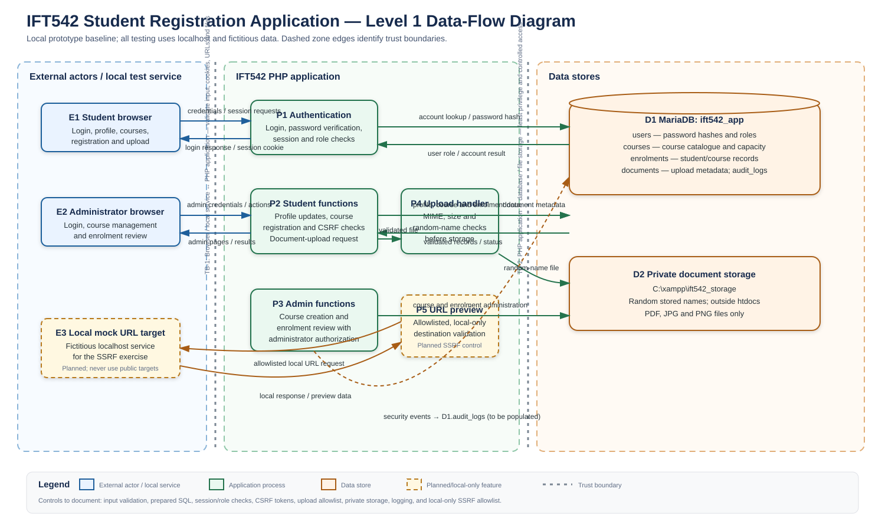

1. Application scope and environment
2. Data-flow diagram and trust boundaries
3. STRIDE threat model
4. Risk register and top-three risks
5. Authentication and SQL-injection remediation
6. Web defences and security testing
7. Logging and incident response
8. Ethics statement
9. Limitations and conclusion

# IFT 542 Practical Assignment Report

## Security Assessment and Hardening of a Student Registration Web Application

**Student:** [Your name]  
**Matriculation number:** [Your matriculation number]  
**Course:** IFT 542  
**Application:** Student Registration Web Application  
**Environment:** Localhost only  

---

## 1. Application Scope and Environment

### 1.1 Purpose

This project implements and assesses a minimal Student Registration Web Application using PHP and MariaDB/MySQL. The application was developed because a lecturer-provided starter application was not available.

The application supports the following fictitious workflows:

- Student and administrator login.
- Student profile updates.
- Course listing and registration.
- Document upload.
- Administrator course creation.
- Administrator enrolment viewing.
- Local-only URL preview/import for SSRF-control testing.
- Security-event logging.

### 1.2 Technology stack

The application was developed and tested using:

- Windows operating system.
- XAMPP Control Panel.
- Apache HTTP Server.
- PHP 8.2.12.
- MariaDB 10.4.32.
- phpMyAdmin.
- PDO for database access.
- HTML and PHP forms.
- Fictitious local test data.

### 1.3 Local testing restriction

All testing was performed on:

```text
localhost


## 2. Data-Flow Diagram and Trust Boundaries

### 2.1 Data-flow diagram



The diagram models the major actors, application processes, data stores, data flows, and trust boundaries in the Student Registration Web Application.

### 2.2 External entities

- **E1 Student browser**
  - Sends login requests, profile updates, course-registration requests, CSRF tokens, and document uploads.
  - Receives pages, session responses, registration results, and upload status.

- **E2 Administrator browser**
  - Sends administrator login requests, course-management requests, and enrolment-review requests.
  - Receives administrator pages and course/enrolment results.

- **E3 Local mock URL target**
  - Provides a fictitious localhost-only response for testing the SSRF protection.
  - No public or third-party URL was used.

### 2.3 Application processes

- **P1 Authentication**
  - Retrieves the account by email.
  - Verifies the password hash.
  - Creates the session and records the user role.
  - Regenerates the session ID after successful login.

- **P2 Student functions**
  - Handles profile updates.
  - Lists courses.
  - Processes course registration.
  - Receives document-upload requests.
  - Verifies CSRF tokens and the authenticated student ID.

- **P3 Administrator functions**
  - Enforces administrator authorization.
  - Adds courses.
  - Displays registered student enrolments.

- **P4 Upload handler**
  - Checks file size and detected MIME type.
  - Generates a random storage filename.
  - Stores document metadata in MariaDB.
  - Stores the file outside the web root.

- **P5 URL-preview process**
  - Validates the submitted URL.
  - Applies the destination allowlist.
  - Rejects loopback, private, link-local, metadata, unsupported-scheme, and unauthorized destinations.
  - Disables redirects and limits request time and response size.

### 2.4 Data stores

- **D1 MariaDB database**
  - `users` stores account details, roles, and password hashes.
  - `courses` stores course information and capacity.
  - `enrolments` stores student-course registrations.
  - `documents` stores uploaded-file metadata.
  - `audit_logs` stores security and application events.

- **D2 Private document storage**
  - Located at `C:\xampp\ift542_storage`.
  - Located outside `htdocs`.
  - Uses random stored filenames.
  - Accepts only validated PDF, JPG, and PNG files.

### 2.5 Data flows

Important data flows include:

- Login credentials from the browser to the authentication process.
- Account lookup and password-hash retrieval between the PHP application and MariaDB.
- Session cookies and authentication results between the application and browser.
- Profile and course-registration data between student functions and MariaDB.
- Course-management data between administrator functions and MariaDB.
- Uploaded file content from the browser to the upload handler.
- Document metadata from the upload handler to MariaDB.
- Randomly named document files from the upload handler to private storage.
- Approved local URL requests from the URL-preview process to the mock target.
- Security events from application processes to `audit_logs`.

### 2.6 Trust boundaries

#### TB-1: Browser or local service to PHP application

All data crossing this boundary is treated as untrusted, including:

- Login identifiers and passwords.
- Profile fields.
- Course IDs.
- Uploaded files.
- URLs.
- Cookies and form submissions.

Controls at this boundary include server-side validation, CSRF tokens, output encoding, session controls, and authorization checks.

#### TB-2: PHP application to MariaDB

The application accesses the database through PDO prepared statements. The runtime database account is restricted to the required application database and does not use the XAMPP root account.

Controls at this boundary include:

- Prepared statements.
- Input validation.
- Least-privilege database access.
- Password hashing.
- Generic error messages.
- Audit logging.

#### TB-3: PHP application to private document storage

Uploaded files are not stored inside the public web root. The application validates the detected MIME type and size before generating a random stored filename.

#### TB-4: PHP application to URL-preview target

The URL-preview process does not accept arbitrary destinations. The exact local mock is permitted only for the isolated demonstration. Other loopback, private-network, link-local, metadata, unsupported-scheme, and unauthorized destinations are rejected before any request is made.

## 3. STRIDE Threat Model

The threat model was created from the application data-flow diagram. Threats were identified against the browsers, PHP application processes, MariaDB database, private document storage, and local URL-preview process.

The detailed worksheet and risk register are provided in:

- [STRIDE worksheet and risk register](IFT542_STRIDE_Risk_Register.xlsx)
- [Risk-register guide](IFT542_STRIDE_Risk_Register_Guide.md)

### 3.1 Risk-scoring method

Each threat was scored using:

```text
Risk = Likelihood × Impact

Copy everything inside this Markdown block into your report:

```markdown
Likelihood and impact were scored from 1 to 5.

- **Likelihood**
  - 1 = Rare.
  - 2 = Unlikely.
  - 3 = Possible.
  - 4 = Likely.
  - 5 = Almost certain.

- **Impact**
  - 1 = Negligible.
  - 2 = Minor.
  - 3 = Moderate.
  - 4 = Major.
  - 5 = Severe.

Risk bands were defined as:

- 1–4 = Low.
- 5–9 = Medium.
- 10–16 = High.
- 17–25 = Critical.

Initial risk represents the threat before the proposed controls. Residual risk represents the expected risk after the controls are applied.

### 3.2 STRIDE Threat Summary

| STRIDE category | Application-specific threat | Initial risk | Residual risk |
|---|---|---:|---:|
| Spoofing | An attacker uses guessed, reused, or stolen credentials or a stolen session to impersonate a student or administrator. | 20 — Critical | 10 — High |
| Tampering | A user manipulates identifiers or request parameters to modify another user’s profile or enrolment. | 16 — High | 4 — Low |
| Repudiation | A user denies making a registration or profile change because actions are not completely recorded in audit logs. | 9 — Medium | 3 — Low |
| Information Disclosure | An unauthorized user obtains uploaded documents, metadata, or database details through insecure access or verbose errors. | 15 — High | 5 — Medium |
| Denial of Service | Repeated login attempts or excessive uploads consume application, database, or storage resources. | 12 — High | 8 — Medium |
| Elevation of Privilege | A student accesses an administrator route or submits an administrator action. | 20 — Critical | 5 — Medium |

### 3.3 Additional Application Threats

Additional threats were included because they directly affect the application:

- **SQL injection:** Raw input in a database query could change query meaning or expose and modify records.
- **Cross-site scripting:** A profile or course value displayed without output encoding could execute in another user’s browser.
- **Cross-site request forgery:** A forged request could register a course or update a profile without the user’s intention.
- **Server-side request forgery:** An unsafe URL-preview feature could access loopback, private, link-local, or metadata services.
- **Security misconfiguration:** Debug settings, default credentials, exposed secrets, missing headers, or unmanaged dependencies could expose the application.

### 3.4 Main Controls

The proposed controls include:

- Slow salted password hashing and secure password verification.
- Generic login errors.
- Session-ID regeneration.
- HttpOnly and SameSite cookies.
- Login rate limiting.
- Server-side authorization checks.
- Prepared SQL statements.
- Input validation.
- CSRF tokens.
- Contextual output encoding.
- Content Security Policy.
- Upload MIME-type and size restrictions.
- Private file storage outside the web root.
- SSRF destination allowlisting.
- Loopback, private, link-local, and metadata-address rejection.
- Security-event logging.
- Least-privilege database access.
- Disabled debug and version-disclosure settings.

No residual risk is accepted at this stage. Residual risks will be monitored and reviewed before final submission.
```

## 4. Risk Register and Top-Three Risks

The complete risk register is provided in:

- [IFT542 STRIDE Risk Register](IFT542_STRIDE_Risk_Register.xlsx)
- [Risk-register guide](IFT542_STRIDE_Risk_Register_Guide.md)

The register records the affected asset or data flow, threat description, likelihood, impact, initial risk, proposed controls, residual risk, treatment, owner, and implementation status.

### 4.1 Risk ranking

| Priority | Risk ID | Risk | Initial risk | Residual risk |
|---:|---|---|---:|---:|
| 1 | S-01 | Spoofing of student or administrator accounts | 20 — Critical | 10 — High |
| 2 | E-01 | Elevation of privilege from student to administrator | 20 — Critical | 5 — Medium |
| 3 | T-02 | SQL injection affecting database flows | 20 — Critical | 5 — Medium |
| 4 | T-01 | Tampering with profile or enrolment records | 16 — High | 4 — Low |
| 5 | M-01 | Security misconfiguration | 16 — High | 4 — Low |
| 6 | I-01 | Unauthorized disclosure of documents or data | 15 — High | 5 — Medium |
| 7 | I-03 | SSRF access to private or metadata services | 15 — High | 5 — Medium |
| 8 | D-01 | Resource exhaustion through login or upload abuse | 12 — High | 8 — Medium |

The first three risks have the same initial score of 20. They were ordered using the breadth of potential impact, privilege exposure, sensitivity of affected data, and consequences of control failure.

### 4.2 Top risk 1 — Spoofing

An attacker could use guessed, reused, or stolen credentials to impersonate a student or administrator. A compromised administrator account would provide access to course management and enrolment information.

This risk is realistic because the application provides login access to several sensitive functions. Account compromise could affect profiles, documents, enrolments, and administrative actions.

Controls include:

- Slow salted password hashing.
- Secure password verification.
- Generic login errors.
- Session-ID regeneration.
- HttpOnly and SameSite cookies.
- Login rate limiting.
- Failed-login logging.
- MFA for privileged accounts as a future improvement.

The initial risk was scored as:

```text
Likelihood 4 × Impact 5 = 20 — Critical
```

After the implemented and proposed controls, the expected residual risk is:

```text
Likelihood 2 × Impact 5 = 10 — High
```

The impact remains severe if an administrator account is compromised, so the residual risk must be monitored.

### 4.3 Top risk 2 — Elevation of Privilege

A student could attempt to access an administrator route or submit an administrator action. If authorization relied only on client-side values, a student could potentially manage courses or view enrolment information.

This risk is realistic because students and administrators use the same application but have different roles and permissions.

Controls include:

- Server-side `require_admin()` checks.
- Deny-by-default authorization.
- Authorization checks on every administrator route and action.
- No trust in client-supplied role values.
- Logging of denied authorization attempts.
- Tests confirming that students cannot access administrator functions.

The initial risk was scored as:

```text
Likelihood 4 × Impact 5 = 20 — Critical
```

The expected residual risk is:

```text
Likelihood 1 × Impact 5 = 5 — Medium
```

The residual impact remains severe because an authorization failure could expose or alter system-wide records.

### 4.4 Top risk 3 — SQL Injection

User-controlled values are submitted through login, profile, course, enrolment, upload, and administrator workflows. If any of these values were concatenated directly into SQL text, an attacker could change query meaning or access and modify database records.

The affected assets include:

- User accounts.
- Password hashes.
- Courses.
- Enrolments.
- Document metadata.
- Audit logs.

Controls include:

- PDO prepared statements.
- Emulated prepares disabled.
- Server-side type, length, and format validation.
- Generic database errors.
- Least-privilege database access.
- Reproducible parameterization tests.

The initial risk was scored as:

```text
Likelihood 4 × Impact 5 = 20 — Critical
```

The expected residual risk is:

```text
Likelihood 1 × Impact 5 = 5 — Medium
```

The current application uses parameterized statements, but the database remains a high-impact asset. Query changes must continue to be reviewed and tested.

### 4.5 Risk treatment

The selected treatment for the highest-priority risks is **mitigate**.

No residual risk is accepted at this stage. Any risk accepted before submission must include:

- The remaining threat.
- Residual likelihood and impact.
- The reason for acceptance.
- The responsible owner.
- Monitoring arrangements.
- A future review or remediation date.

## 5. Authentication and SQL-Injection Remediation

### 5.1 Authentication flow

The login process is implemented in:

```text
login.php
```

The database connection is implemented in:

```text
config/database.php
```

The authentication and session controls are implemented in:

```text
includes/auth.php
```

The application retrieves the account by email, then verifies the submitted password against the stored password hash. It does not compare plaintext passwords in the database.

The authentication process performs the following actions:

1. Validates the email format and password presence.
2. Retrieves the account using a prepared statement.
3. Verifies the password using `password_verify()`.
4. Regenerates the session ID after successful authentication.
5. Stores only the user ID, display name, and role in the session.
6. Redirects the user to the dashboard.
7. Records a safe authentication event.
8. Returns a generic error for invalid credentials.

The application does not reveal whether an email address exists.

### 5.2 Password protection

Passwords are created using a slow salted password-hashing function and verified with `password_verify()`.

The database contains values similar to:

```text
$2y$10$...
```

rather than plaintext values such as:

```text
StudentPass!2026
```

Password-hash evidence is recorded in:

```text
tests/evidence/AUTH-03-password-hashes.jpg
```

### 5.3 Additional authentication controls

The application includes:

- Session-ID regeneration after login.
- HttpOnly session cookies.
- SameSite session cookies.
- Login rate limiting.
- Generic failed-login messages.
- Failed-login security logging.
- Server-side role authorization.

The rate limit allows five unsuccessful attempts within five minutes from the same client IP. Further attempts are temporarily blocked and recorded as `login_rate_limited`.

Because the application is tested on localhost, multiple local accounts may share the same client address. This is documented as a prototype limitation.

### 5.4 Unsafe SQL pattern and remediation

The affected data flow is:

```text
Browser input → PHP request handler → MariaDB query
```

An unsafe implementation would concatenate user input into SQL text. The following example is documentation only and is not active in the application:

```php
// Unsafe example — documentation only; not executable.
$sql = "SELECT id, password_hash
        FROM users
        WHERE email = '" . $email . "'";
```

This pattern is unsafe because the user-controlled value becomes part of the SQL command. It can change the intended meaning of the query and expose or modify database records.

The corrected implementation uses a prepared statement:

```php
$statement = db()->prepare(
    'SELECT
        id,
        full_name,
        email,
        password_hash,
        role
     FROM users
     WHERE email = :email
     LIMIT 1'
);

$statement->execute([
    ':email' => $email,
]);
```

The same parameterized approach is used in:

```text
profile.php
courses.php
upload.php
admin/index.php
```

The database connection also disables emulated prepares:

```php
PDO::ATTR_EMULATE_PREPARES => false
```

Parameterization separates the SQL command from the user-controlled value. The database receives the query structure and the value separately, so characters within the value are treated as data rather than SQL syntax.

### 5.5 Input validation and error handling

The application validates:

- Email format.
- Text length.
- Course identifiers.
- Course codes.
- Course capacity.
- Upload MIME type.
- Upload size.
- URL scheme, host, port, and resolved address.

Database and authentication errors are logged on the server but are not displayed to users. User-facing responses remain generic.

### 5.6 Authentication and SQL-injection test evidence

The following reproducible tests were completed:

| Test | Evidence |
|---|---|
| Valid student login | `tests/evidence/AUTH-01-valid-login.jpg` |
| Invalid credentials | `tests/evidence/AUTH-02-invalid-login.jpg` |
| Password hashes | `tests/evidence/AUTH-03-password-hashes.jpg` |
| Student administrator-access denial | `tests/evidence/AUTH-04-admin-access-denied.jpg` |
| Login rate limiting | `tests/evidence/AUTH-05-rate-limit.jpg` |
| Parameterized profile update using an apostrophe-containing name | `tests/evidence/SQL-01-parameterized-profile.jpg` |

The parameterization test used the harmless fictitious value:

```text
O'Connor Test
```

The profile update succeeded and stored the exact value without producing a database error. This demonstrates that the apostrophe was treated as data.

## 6. Web Defences and Configuration Hardening

### 6.1 Cross-site scripting protection

The application uses contextual output encoding when displaying user-controlled values.

Examples include:

- Student names.
- Profile fields.
- Course titles.
- Course descriptions.
- Uploaded filenames.
- Error and status messages.

The application uses:

```php
htmlspecialchars(
    $value,
    ENT_QUOTES,
    'UTF-8'
)
```

Untrusted values are not inserted into raw HTML or executable JavaScript.

A Content Security Policy is also applied through Apache:

```text
default-src 'self';
object-src 'none';
frame-ancestors 'none';
form-action 'self';
script-src 'self';
style-src 'self';
img-src 'self' data:
```

The XSS test used the harmless marker:

```text
<b>Safe Marker</b>
```

The marker was displayed as literal text rather than being rendered as bold HTML.

Evidence:

```text
tests/evidence/XSS-01-output-encoding.jpg
```

### 6.2 Cross-site request forgery protection

State-changing forms contain a server-generated CSRF token.

The token is:

- Generated using `random_bytes()`.
- Stored in the user session.
- Included as a hidden form value.
- Verified server-side before the action is processed.

CSRF protection is applied to:

- Profile updates.
- Course registration.
- Course creation.
- Document uploads.
- URL-preview requests.

The session cookie also uses:

```text
SameSite=Lax
HttpOnly
```

The following tests were completed:

- A request without a CSRF token was rejected.
- A request with a valid CSRF token succeeded.

Evidence:

```text
tests/evidence/CSRF-01-missing-token.jpg
tests/evidence/CSRF-02-valid-token.jpg
```

### 6.3 Server-side request forgery protection

The URL-preview feature is implemented in:

```text
url_preview.php
includes/ssrf_guard.php
mock_target.php
```

The SSRF controls include:

- HTTP and HTTPS scheme restrictions.
- Rejection of embedded credentials.
- Port restrictions.
- Explicit destination allowlisting.
- DNS resolution before requests.
- Rejection of loopback addresses.
- Rejection of private-network addresses.
- Rejection of link-local addresses.
- Rejection of metadata addresses.
- Redirects disabled.
- Connection and total request timeouts.
- Response-size limit.
- Response content-type restrictions.
- IP pinning for approved non-lab destinations.
- Escaped output for preview content.

The only successful local demonstration uses the exact fictitious mock URL:

```text
http://localhost/ift542_app/mock_target.php
```

The following destinations were rejected:

- Arbitrary loopback address.
- Unauthorized localhost path.
- Metadata address.
- Unsupported `file` scheme.
- Modified mock URL containing an unauthorized query string.

Evidence:

```text
tests/evidence/SSRF-01-approved-local-preview.jpg
tests/evidence/SSRF-02-loopback-rejected.jpg
tests/evidence/SSRF-03-metadata-rejected.jpg
tests/evidence/SSRF-04-unsupported-scheme.jpg
```

The lab-only SSRF exception is restricted to localhost testing and must not be enabled for an exposed deployment.

### 6.4 Secure document upload

The upload process is implemented in:

```text
upload.php
```

Controls include:

- Allowing only PDF, JPG, and PNG MIME types.
- Detecting MIME type using server-side file inspection.
- Limiting files to 5 MB.
- Rejecting unsupported file types.
- Generating random stored filenames.
- Storing files outside the public web root.
- Recording only safe metadata in the database.
- Escaping original filenames when displayed.

Evidence:

```text
tests/evidence/UPLOAD-01-invalid-type.jpg
tests/evidence/UPLOAD-02-valid-document.jpg
```

### 6.5 Security headers and configuration

Apache applies the following headers:

- `Content-Security-Policy`.
- `X-Content-Type-Options: nosniff`.
- `X-Frame-Options: DENY`.
- `Referrer-Policy`.
- `Permissions-Policy`.

The application also:

- Disables directory listings.
- Blocks direct access to configuration and SQL files.
- Protects the `config`, `includes`, and `database` directories.
- Disables PHP browser error display.
- Enables server-side error logging.
- Hides detailed Apache version information.
- Removes the PHP `X-Powered-By` header.
- Uses a dedicated runtime database account.
- Stores database credentials in environment variables rather than source code.

Evidence:

```text
tests/evidence/CONFIG-01-security-headers.txt
tests/evidence/CONFIG-02-database-grants.jpg
```

The database grant evidence remains deferred and must be completed before final submission.

### 6.6 Security logging

Security events are written to the `audit_logs` table.

Logged events include:

- Successful logins.
- Failed logins.
- Rate-limited login attempts.
- Authorization denials.
- Rejected URL-preview requests.
- Successful URL previews.
- Rejected validation requests.

Log records contain:

- User ID when known.
- Event type.
- Event action.
- Local IP address.
- Safe event details.
- Timestamp.

The logger deliberately excludes:

- Passwords.
- Password hashes.
- CSRF tokens.
- Session tokens.
- API keys.
- Unnecessary personal information.

Evidence:

```text
tests/evidence/LOG-01-security-event-coverage.jpg
tests/evidence/login-rate-limit.jpg
```

## 7. Security Testing Summary

The following tests were performed using fictitious data on localhost:

| Test ID | Description | Status |
|---|---|---|
| AUTH-01 | Valid student login | Passed |
| AUTH-02 | Invalid credentials | Passed |
| AUTH-03 | Password hash storage | Passed |
| AUTH-04 | Student administrator-access denial | Passed |
| AUTH-05 | Login rate limiting | Passed |
| SQL-01 | Parameterized profile update | Passed |
| CSRF-01 | Missing CSRF token rejection | Passed |
| CSRF-02 | Valid CSRF token | Passed |
| XSS-01 | Contextual output encoding | Passed |
| UPLOAD-01 | Disallowed file type | Passed |
| UPLOAD-02 | Valid document upload | Passed |
| CONFIG-01 | Security response headers | Passed |
| SSRF-01 | Approved local mock preview | Passed |
| SSRF-02 | Loopback destination rejection | Passed |
| SSRF-03 | Metadata address rejection | Passed |
| SSRF-04 | Unsupported URL scheme | Passed |
| ADMIN-01 | Administrator course creation | Passed |
| ADMIN-02 | Administrator enrolment viewing | Passed |
| LOG-01 | Security-event coverage | Passed |
| CONFIG-02 | Least-privilege database-account evidence | Deferred |

Detailed procedures are recorded in:

```text
tests/test-results.md
```

Evidence files are stored in:

```text
tests/evidence/
```

## 8. Security Logging and Incident Response

### 8.1 Logging objectives

The logging system supports detection, investigation, and accountability. It records security-relevant actions without storing passwords, session tokens, CSRF tokens, or unnecessary personal information.

Important logged events include:

- `login_success`
- `login_failure`
- `login_rate_limited`
- `access_denied`
- `url_preview_success`
- `url_preview_rejected`
- `login_rejected`

### 8.2 Incident-response runbook

#### Preparation

- Maintain the application source, database schema, and README.
- Keep testing restricted to localhost.
- Use fictitious accounts and data.
- Maintain security logs.
- Keep backups of the working application.
- Ensure secrets are stored outside the repository.
- Identify the application owner and incident handler.

#### Detection and analysis

- Review authentication, authorization, upload, and SSRF logs.
- Confirm the event timestamp and affected user or request.
- Identify the affected route, record, or file.
- Preserve the relevant log entries and screenshots.
- Determine whether passwords, tokens, documents, or database records were exposed.

#### Containment

- Disable affected accounts or routes if necessary.
- Stop the affected feature while preserving evidence.
- Rotate any compromised credentials.
- Restrict access to the local application.
- Prevent further uploads or URL requests if those features are involved.

#### Eradication

- Identify and remove the vulnerability.
- Correct unsafe queries or authorization checks.
- Remove unauthorized files or records.
- Review dependencies and configuration.
- Verify that debug mode and default credentials are disabled.

#### Recovery

- Restore the corrected application.
- Re-run the relevant security tests.
- Confirm that authentication, authorization, logging, and data flows work normally.
- Monitor the application for repeated suspicious events.

#### Lessons learned

- Document the timeline and root cause.
- Record affected assets and users.
- Identify which control failed.
- Update the risk register.
- Add or improve automated tests.
- Update the runbook and application controls.

### 8.3 Fictitious incident record

**Incident ID:** IR-001  
**Application:** IFT542 Student Registration Web Application  
**Environment:** Localhost  
**Incident type:** Repeated failed logins and rejected URL-preview requests  
**Data classification:** Fictitious academic data  

**Detection:** Security logs recorded repeated `login_failure`, `login_rate_limited`, and `url_preview_rejected` events.

**Initial analysis:** The events originated from the local test client. No external system was contacted and no credential, token, or document exposure was identified.

**Containment:** The login rate limiter blocked further attempts temporarily. The URL-preview validation rejected loopback, metadata, and unsupported-scheme destinations.

**Eradication:** The authentication rate limit and SSRF allowlist were verified. No unauthorized database or file changes were found.

**Recovery:** Valid student and administrator logins were tested after the rate-limit window expired. Approved local URL preview continued to work.

**Lessons learned:** Security logs, generic errors, rate limiting, destination allowlists, and reproducible tests should remain part of the application baseline.

## 9. Professional Ethics Statement

I confirm that the security assessment and hardening activities for this project were conducted responsibly and within the authorized scope.

I confirm that:

- Testing was performed only on localhost.
- Only fictitious data and test accounts were used.
- No FUT Minna system was scanned or tested.
- No public website or third-party service was targeted.
- No external database or API was accessed.
- No real credentials, passwords, tokens, or identity documents were used.
- Findings were documented accurately.
- Security controls were implemented and tested defensively.
- Reusable attack payloads and secrets were excluded from the submission.
- Evidence and logs were redacted where necessary.

**Student name:** ______________________________

**Matriculation number:** ________________________

**Signature:** ___________________________________

**Date:** _______________________________________

## 10. Limitations and Future Improvements

- The application is a local academic prototype and is not intended for production deployment.
- Rate limiting is based on client IP, so localhost users may share the same rate-limit window.
- MFA for administrator accounts was not implemented.
- The URL-preview lab exception is restricted to one exact localhost mock URL.
- The runtime database account evidence must be finalized before submission.
- A production deployment would require HTTPS, centralized monitoring, stronger secret management, backups, and formal dependency scanning.
- The application should receive a full independent security review before any real student data is used.

## 11. Conclusion

This project implemented and assessed a minimal PHP/MariaDB Student Registration Web Application. The assessment used STRIDE threat modelling, risk scoring, secure authentication, prepared SQL statements, session controls, CSRF protection, XSS output encoding, SSRF destination validation, secure uploads, security headers, least-privilege database access, and security-event logging.

The highest risks identified were spoofing, elevation of privilege, and SQL injection. These risks were addressed through password hashing, rate limiting, server-side role checks, prepared statements, input validation, and reproducible security tests.

All testing was limited to localhost and fictitious data. The remaining submission tasks are to finalize the deferred database-grant evidence, complete the ethics and report metadata, verify all evidence filenames, remove secrets and temporary lab settings, and submit the GitHub repository using the required naming format.
